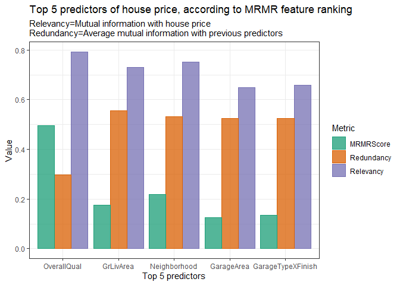
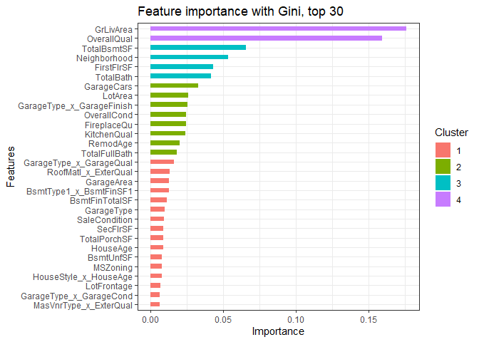
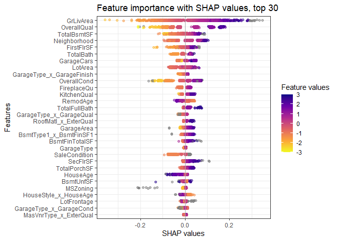
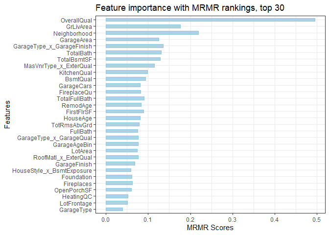

House Prices Regression - Feature Engineering, XGBoost
================
Ahmet Zamanis
2022-09-06

-   <a href="#introduction" id="toc-introduction">Introduction</a>
-   <a href="#data-preparation" id="toc-data-preparation">Data
    Preparation</a>
    -   <a href="#data-cleaning-feature-engineering"
        id="toc-data-cleaning-feature-engineering">Data cleaning, feature
        engineering</a>
    -   <a href="#missing-value-imputation-with-random-forest"
        id="toc-missing-value-imputation-with-random-forest">Missing value
        imputation with random forest</a>
-   <a href="#encoding-preprocessing"
    id="toc-encoding-preprocessing">Encoding, preprocessing</a>
    -   <a href="#ordinal-encoding" id="toc-ordinal-encoding">Ordinal
        encoding</a>
    -   <a href="#nominal-encoding-model-recipe"
        id="toc-nominal-encoding-model-recipe">Nominal encoding, model
        recipe</a>
-   <a href="#feature-selection-modeling"
    id="toc-feature-selection-modeling">Feature selection, modeling</a>
    -   <a href="#feature-selection-with-mrmr"
        id="toc-feature-selection-with-mrmr">Feature selection with MRMR</a>
    -   <a href="#modeling-with-xgboost" id="toc-modeling-with-xgboost">Modeling
        with XGBoost</a>
-   <a href="#possible-improvements" id="toc-possible-improvements">Possible
    improvements</a>

## Introduction

This is a report on my approach to the Kaggle House Prices Regression
[contest](https://www.kaggle.com/competitions/house-prices-advanced-regression-techniques).
The goal is to predict the sale prices of homes, using a dataset of 80+
house attributes. The report will focus on data cleaning and feature
engineering steps, as there is a lot that can be done with these 80+
features. For modeling, I used tree-based gradient boosting with
XGBoost. I will discuss my approach to feature selection with MRMR, and
hyperparameter tuning.  
  
Entries into rolling competitions such as these are removed in 2 months.
At the time of submission in September 2022, my best score was an RMSLE
(root mean square log error) of 0.12143, placing me at 271th out of
roughly 3800 teams, which is top 8%. I have made a total of 5
submissions at the time of writing this, the 4th being the best one.

## Data Preparation

Let’s load the required packages.

``` r
library(rmarkdown) #markdown documents for github
library(tidyverse) #data handling
library(missForest) #missing value imputation with random forest
library(tidymodels) #model preprocessing and fitting with recipes
library(embed) #target encoding for tidymodels recipes
library(mRMRe) #feature selection with MRMR
library(caret) #parameter tuning and crossvalidation
library(xgboost) #gradient boosting
```

  
  
Let’s load the original training and testing data, and combine them for
the purpose of data cleaning & feature engineering.

``` r
#load original data
df_train <- read.csv("./RawData/train.csv", header=TRUE, encoding="UTF-8")
df_test <- read.csv("./RawData/test.csv", header=TRUE, encoding="UTF-8")
df_test$SalePrice <- NA

#combine training and testing data, create a copy to work on
df <- rbind(df_train, df_test)
df1 <- df
rm(df_test, df_train)
```

  
  
Let’s see the first rows of our raw dataset, and the proportion of
missing values.

``` r
#view first rows
head(df)
```

    ##   Id MSSubClass MSZoning LotFrontage LotArea Street Alley LotShape LandContour
    ## 1  1         60       RL          65    8450   Pave  <NA>      Reg         Lvl
    ## 2  2         20       RL          80    9600   Pave  <NA>      Reg         Lvl
    ## 3  3         60       RL          68   11250   Pave  <NA>      IR1         Lvl
    ## 4  4         70       RL          60    9550   Pave  <NA>      IR1         Lvl
    ## 5  5         60       RL          84   14260   Pave  <NA>      IR1         Lvl
    ## 6  6         50       RL          85   14115   Pave  <NA>      IR1         Lvl
    ##   Utilities LotConfig LandSlope Neighborhood Condition1 Condition2 BldgType
    ## 1    AllPub    Inside       Gtl      CollgCr       Norm       Norm     1Fam
    ## 2    AllPub       FR2       Gtl      Veenker      Feedr       Norm     1Fam
    ## 3    AllPub    Inside       Gtl      CollgCr       Norm       Norm     1Fam
    ## 4    AllPub    Corner       Gtl      Crawfor       Norm       Norm     1Fam
    ## 5    AllPub       FR2       Gtl      NoRidge       Norm       Norm     1Fam
    ## 6    AllPub    Inside       Gtl      Mitchel       Norm       Norm     1Fam
    ##   HouseStyle OverallQual OverallCond YearBuilt YearRemodAdd RoofStyle RoofMatl
    ## 1     2Story           7           5      2003         2003     Gable  CompShg
    ## 2     1Story           6           8      1976         1976     Gable  CompShg
    ## 3     2Story           7           5      2001         2002     Gable  CompShg
    ## 4     2Story           7           5      1915         1970     Gable  CompShg
    ## 5     2Story           8           5      2000         2000     Gable  CompShg
    ## 6     1.5Fin           5           5      1993         1995     Gable  CompShg
    ##   Exterior1st Exterior2nd MasVnrType MasVnrArea ExterQual ExterCond Foundation
    ## 1     VinylSd     VinylSd    BrkFace        196        Gd        TA      PConc
    ## 2     MetalSd     MetalSd       None          0        TA        TA     CBlock
    ## 3     VinylSd     VinylSd    BrkFace        162        Gd        TA      PConc
    ## 4     Wd Sdng     Wd Shng       None          0        TA        TA     BrkTil
    ## 5     VinylSd     VinylSd    BrkFace        350        Gd        TA      PConc
    ## 6     VinylSd     VinylSd       None          0        TA        TA       Wood
    ##   BsmtQual BsmtCond BsmtExposure BsmtFinType1 BsmtFinSF1 BsmtFinType2
    ## 1       Gd       TA           No          GLQ        706          Unf
    ## 2       Gd       TA           Gd          ALQ        978          Unf
    ## 3       Gd       TA           Mn          GLQ        486          Unf
    ## 4       TA       Gd           No          ALQ        216          Unf
    ## 5       Gd       TA           Av          GLQ        655          Unf
    ## 6       Gd       TA           No          GLQ        732          Unf
    ##   BsmtFinSF2 BsmtUnfSF TotalBsmtSF Heating HeatingQC CentralAir Electrical
    ## 1          0       150         856    GasA        Ex          Y      SBrkr
    ## 2          0       284        1262    GasA        Ex          Y      SBrkr
    ## 3          0       434         920    GasA        Ex          Y      SBrkr
    ## 4          0       540         756    GasA        Gd          Y      SBrkr
    ## 5          0       490        1145    GasA        Ex          Y      SBrkr
    ## 6          0        64         796    GasA        Ex          Y      SBrkr
    ##   X1stFlrSF X2ndFlrSF LowQualFinSF GrLivArea BsmtFullBath BsmtHalfBath FullBath
    ## 1       856       854            0      1710            1            0        2
    ## 2      1262         0            0      1262            0            1        2
    ## 3       920       866            0      1786            1            0        2
    ## 4       961       756            0      1717            1            0        1
    ## 5      1145      1053            0      2198            1            0        2
    ## 6       796       566            0      1362            1            0        1
    ##   HalfBath BedroomAbvGr KitchenAbvGr KitchenQual TotRmsAbvGrd Functional
    ## 1        1            3            1          Gd            8        Typ
    ## 2        0            3            1          TA            6        Typ
    ## 3        1            3            1          Gd            6        Typ
    ## 4        0            3            1          Gd            7        Typ
    ## 5        1            4            1          Gd            9        Typ
    ## 6        1            1            1          TA            5        Typ
    ##   Fireplaces FireplaceQu GarageType GarageYrBlt GarageFinish GarageCars
    ## 1          0        <NA>     Attchd        2003          RFn          2
    ## 2          1          TA     Attchd        1976          RFn          2
    ## 3          1          TA     Attchd        2001          RFn          2
    ## 4          1          Gd     Detchd        1998          Unf          3
    ## 5          1          TA     Attchd        2000          RFn          3
    ## 6          0        <NA>     Attchd        1993          Unf          2
    ##   GarageArea GarageQual GarageCond PavedDrive WoodDeckSF OpenPorchSF
    ## 1        548         TA         TA          Y          0          61
    ## 2        460         TA         TA          Y        298           0
    ## 3        608         TA         TA          Y          0          42
    ## 4        642         TA         TA          Y          0          35
    ## 5        836         TA         TA          Y        192          84
    ## 6        480         TA         TA          Y         40          30
    ##   EnclosedPorch X3SsnPorch ScreenPorch PoolArea PoolQC Fence MiscFeature
    ## 1             0          0           0        0   <NA>  <NA>        <NA>
    ## 2             0          0           0        0   <NA>  <NA>        <NA>
    ## 3             0          0           0        0   <NA>  <NA>        <NA>
    ## 4           272          0           0        0   <NA>  <NA>        <NA>
    ## 5             0          0           0        0   <NA>  <NA>        <NA>
    ## 6             0        320           0        0   <NA> MnPrv        Shed
    ##   MiscVal MoSold YrSold SaleType SaleCondition SalePrice
    ## 1       0      2   2008       WD        Normal    208500
    ## 2       0      5   2007       WD        Normal    181500
    ## 3       0      9   2008       WD        Normal    223500
    ## 4       0      2   2006       WD       Abnorml    140000
    ## 5       0     12   2008       WD        Normal    250000
    ## 6     700     10   2009       WD        Normal    143000

``` r
#calculate proportion of missing values
sum(is.na(df)) / (nrow(df)*ncol(df))
```

    ## [1] 0.06523458

6.5% of the values in our dataset are missing.

### Data cleaning, feature engineering

In my original approach, I examined the columns one by one, together
with the data description that is downloaded along with the datasets.
Here, I will only go over the data cleaning and feature engineering
operations I ended up using for the final version. There are many
categorical features with high cardinality, i.e. a high number of
levels, so I won’t describe the meaning of all values and levels here.  
  
The first column is MSSubClass, the type of dwelling as a numeric code.
For example, 20 corresponds to “1-STORY 1946 & NEWER ALL STYLES”,
according to the data description file. For a full description of each
style / level, see the data description file.

``` r
summary(as.factor(df1$MSSubClass))
```

    ##   20   30   40   45   50   60   70   75   80   85   90  120  150  160  180  190 
    ## 1079  139    6   18  287  575  128   23  118   48  109  182    1  128   17   61

The levels of this categorical feature include more than one type of
information about the house: House style / number of stories, the age
bracket, house finish status, and whether the house is part of a planned
development unit (PUD). It makes sense to split these different types of
information into separate features, and then combine some of MSSubClass’
levels.  
  
Let’s create a binary feature that indicates whether a house is part of
a PUD or not.

``` r
#create binary categorical variable from MSSubClass: PUD
df1 <- df1%>% mutate(df1, PUD = 
                       ifelse(MSSubClass %in% c("120","150","160","180"), "Yes", "No"),
                     .after = MSSubClass)

summary(as.factor(df1$PUD))
```

    ##   No  Yes 
    ## 2591  328

Two other features in the dataset store common information with
MSSubClass: HouseStyle stores information on house style and number of
stories, while YearBuilt stores year of construction. There are some
mismatches between these features, and we’ll ensure they all conform to
MSSubClass, as it has more detailed levels.

``` r
#ensure MSSubClass matches with HouseStyle, YearBuilt
df1$HouseStyle[df1$MSSubClass==20] <- "1Story"
df1$YearBuilt[df1$MSSubClass==20 & df1$YearBuilt < 1946] <- 1946

df1$HouseStyle[df1$MSSubClass==30] <- "1Story"
df1$YearBuilt[df1$MSSubClass==30 & df1$YearBuilt > 1945] <- 1945

df1$HouseStyle[df1$MSSubClass==40] <- "1Story"

df1$HouseStyle[df1$MSSubClass==120] <- "1Story"
df1$YearBuilt[df1$MSSubClass==120 & df1$YearBuilt > 1946] <- 1946


df1$HouseStyle[df1$MSSubClass==45] <- "1.5Unf"
df1$HouseStyle[df1$MSSubClass==50] <- "1.5Fin"


df1$HouseStyle[df1$MSSubClass==60] <- "2Story"
df1$YearBuilt[df1$MSSubClass==60 & df1$YearBuilt < 1946] <- 1946

df1$HouseStyle[df1$MSSubClass==70] <- "2Story"
df1$YearBuilt[df1$MSSubClass==70 & df1$YearBuilt > 1945] <- 1945


df1$HouseStyle[df1$MSSubClass==75 & !(df1$HouseStyle %in% c("2.5Fin", "2.5Unf"))] <- "2.5Unf"
```

  
Now, we’ll combine some of MSSubClass’ levels, according to the house
style. We’ll ignore the year and house finish information, as these are
already captured in the features HouseStyle (which we will also split
later) and YrBuilt. We’ll also rename the values, from numbers, to text
values based on house style.

``` r
#group MSSubClass levels according to house style, ignoring year and finish
df1$MSSubClass[df1$MSSubClass %in% c("20", "30", "120")] <- "1Story"
df1$MSSubClass[df1$MSSubClass %in% c("40")] <- "1StoryAtt"
df1$MSSubClass[df1$MSSubClass %in% c("45", "50", "150")] <- "1.5Story"
df1$MSSubClass[df1$MSSubClass %in% c("60", "70", "160")] <- "2Story"
df1$MSSubClass[df1$MSSubClass %in% c("75")] <- "2.5Story"
df1$MSSubClass[df1$MSSubClass %in% c("80")] <- "SplitMult"
df1$MSSubClass[df1$MSSubClass %in% c("85")] <- "SplitFoyer"
df1$MSSubClass[df1$MSSubClass %in% c("90")] <- "Duplex"
df1$MSSubClass[df1$MSSubClass %in% c("180")] <- "MultLev"
df1$MSSubClass[df1$MSSubClass %in% c("190")] <- "2Fam"
```

Now, MSSubClass only stores the house style and number of stories, which
will still have some redundancy with HouseStyle.  
  
The Alley feature stores the type of alley access to the property. This
feature has a lot of missing values, which are cases of no alley access
according to the data description. We will replace them as such.

``` r
summary(as.factor(df1$Alley))
```

    ## Grvl Pave NA's 
    ##  120   78 2721

``` r
#replace NAs with "None"
df1$Alley <- replace_na(df1$Alley, "None")
```

  
  
The utilities column stores the type of utilities available in the
house, but it consists almost entirely of one level, there is almost
zero variation. It’s not going to be a useful predictor, so we’ll drop
it.

``` r
summary(as.factor(df1$Utilities))
```

    ## AllPub NoSeWa   NA's 
    ##   2916      1      2

``` r
#drop column
df1 <- dplyr::select(df1, -c("Utilities"))
```

  
  
Condition1 and Condition2 record the proximity to various conditions
such as being near a rail station, or a main street. These are two
instances of the same feature, each recording more than one type of
information. We want to break them up into separate, non-redundant
features, each recording one type of information. First, we need to set
Condition2 values to “normal” if it is the same value as Condition1, to
avoid redundancy.

``` r
#Condition1 and Condition2: Proximity to various conditions
summary(as.factor(df1$Condition1))
```

    ## Artery  Feedr   Norm   PosA   PosN   RRAe   RRAn   RRNe   RRNn 
    ##     92    164   2511     20     39     28     50      6      9

``` r
summary(as.factor(df1$Condition2))
```

    ## Artery  Feedr   Norm   PosA   PosN   RRAe   RRAn   RRNn 
    ##      5     13   2889      4      4      1      1      2

``` r
#set Condition2 to Norm if it's equal to Condition1
df1$Condition2[df1$Condition2==df1$Condition1] <- "Norm"
```

Now, we can separate the two features into new features NearStreet,
NearRail and NearPos, each recording the presence of a different type of
condition. Afterwards, we’ll drop the original Condition1 and Condition2
columns.

``` r
#split Condition1 and Condition2 into separate variables: NearStreet, NearRail, NearPos

#NearStreet (Artery, Feeder, neither, both)
df1 <- df1 %>% mutate(df1, NearStreet=
                        ifelse(df1$Condition1=="Artery" | df1$Condition2=="Artery",
                               ifelse(df1$Condition1=="Feedr" | df1$Condition2=="Feedr", "Both", "Artery"),
                               ifelse(df1$Condition1=="Feedr" | df1$Condition2=="Feedr", "Feeder", "Neither")), 
                      .after=Neighborhood)

summary(as.factor(df1$NearStreet))
```

    ##  Artery    Both  Feeder Neither 
    ##      94       1     172    2652

``` r
#NearRail (Near, Adjacent, Neither)
df1 <- df1 %>% mutate(df1, NearRail=
                        ifelse(df1$Condition1 %in% c("RRNn", "RRNe") | df1$Condition2 %in% c("RRNn", "RRNe"),
                               "Near",
                               ifelse(df1$Condition1 %in% c("RRAn", "RRAe") | df1$Condition2 %in% c("RRAn", "RRAe"),
                                      "Adj",
                                      "Neither")),
                      .after=NearStreet)

summary(as.factor(df1$NearRail))
```

    ##     Adj    Near Neither 
    ##      80      17    2822

``` r
#NearPos (Near, Adjacent, Neither)
df1 <- df1 %>% mutate(df1, NearPos=
                        ifelse(df1$Condition1=="PosN" | df1$Condition2=="PosN",
                               "Near",
                               ifelse(df1$Condition1=="PosA" | df1$Condition2=="PosA",
                                      "Adj",
                                      "Neither")),
                      .after=NearRail)

summary(as.factor(df1$NearPos))
```

    ##     Adj    Near Neither 
    ##      21      39    2859

``` r
#drop Condition1 and Condition2 columns
df1 <- dplyr::select(df1, -c("Condition1", "Condition2"))
```

  
  
BldgType stores the type of dwelling, and shares some levels with
MSSubClass. We’ll ensure the values of these levels conform to
MSSubClass.

``` r
#BldgType: Type of dwelling
summary(as.factor(df1$BldgType))
```

    ##   1Fam 2fmCon Duplex  Twnhs TwnhsE 
    ##   2425     62    109     96    227

``` r
#ensure MSSubClass matches with BldgType
df1$BldgType[df1$MSSubClass=="2Fam"] <- "2fmCon"
```

  
  
HouseStyle records several types of information: House style / number of
stories, and the finish of the second story for some levels. We’ll split
the finish level information into a binary feature, UnfLev. Then we’ll
group some of HouseStyle’s levels, regardless of finish level.

``` r
#HouseStyle: Style of dwelling
summary(as.factor(df1$HouseStyle))
```

    ## 1.5Fin 1.5Unf 1Story 2.5Fin 2.5Unf 2Story SFoyer   SLvl 
    ##    312     19   1479      7     22    873     81    126

``` r
#create binary categorical variable UnfLev: whether the house has unfinished levels or not
df1 <- df1 %>% mutate(df1, UnfLev=
                        ifelse(df1$HouseStyle %in% c("1.5Unf", "2.5Unf"), "Yes", "No"), .after=HouseStyle)

summary(as.factor(df1$UnfLev))
```

    ##   No  Yes 
    ## 2878   41

``` r
#group some levels of HouseStyle: 1Story, 1.5Story, 2Story, 2.5Story, SFoyer, SLvl
df1$HouseStyle[df1$HouseStyle %in% c("1.5Fin", "1.5Unf")] <- "1.5Story"
df1$HouseStyle[df1$HouseStyle %in% c("2.5Fin", "2.5Unf")] <- "2.5Story"
```

Now, HouseStyle only records the house style / number of stories, and is
only partly redundant with MSSubClass.  
  
The next feature of interest is YearBuilt, which is a time feature that
records the construction year of the house. There are a few more time
features in the dataset:

-   YearRemodAdd records the remodel year of the house,
-   GarageYrBlt records the construction year of the garage,
-   YrSold records the sale year.

Logically, we expect certain conditions between these features to hold.
For example, YearRemodAdd can’t be smaller (older) than YearBuilt. We’ll
check these, and if they are violated, replace them with the value of
the appropriate feature.

``` r
mean(df1$YearBuilt <= df1$YearRemodAdd)
```

    ## [1] 0.9996574

``` r
#there are observations where YearRemodAdd < YearBuilt. set them equal to YearBuilt
df1$YearRemodAdd[df1$YearBuilt > df1$YearRemodAdd] <- df1$YearBuilt[df1$YearBuilt > df1$YearRemodAdd]
```

  

``` r
mean(df1$YearBuilt[!(is.na(df1$GarageYrBlt))] <= df1$GarageYrBlt[!(is.na(df1$GarageYrBlt))])
```

    ## [1] 0.9931159

``` r
#there are observations where GarageYrBlt < YearBuilt. set them equal to YearBuilt
df1$GarageYrBlt[!(is.na(df1$GarageYrBlt)) & df1$YearBuilt > df1$GarageYrBlt] <- 
  df1$YearBuilt[!(is.na(df1$GarageYrBlt)) & df1$YearBuilt > df1$GarageYrBlt]
```

  
It’s technically possible for YrSold to be smaller (older) than
YearBuilt, if the house is pre-sold before construction is finished.
There are only a few such cases in the data, with no corresponding
feature or explanation, so we’ll assume they are mistakes.

``` r
mean(df1$YearBuilt <= df1$YrSold)
```

    ## [1] 0.9996574

``` r
#there are observations where YrSold < YearBuilt. set them equal to YearBuilt
df1$YrSold[df1$YearBuilt > df1$YrSold] <- df1$YearBuilt[df1$YearBuilt > df1$YrSold]
```

  

``` r
mean(df1$YearRemodAdd <= df1$YrSold)
```

    ## [1] 0.9989723

``` r
#there are observations where YearRemodAdd > YrSold. set them equal to YrSold
df1$YearRemodAdd[df1$YearRemodAdd > df1$YrSold] <- df1$YrSold[df1$YearRemodAdd > df1$YrSold]
```

  

``` r
mean(df1$GarageYrBlt[!(is.na(df1$GarageYrBlt))] <= df1$YrSold[!(is.na(df1$GarageYrBlt))])
```

    ## [1] 0.9996377

``` r
#there are observations where GarageYrBlt > YrSold. set them equal to YrSold
df1$GarageYrBlt[!(is.na(df1$GarageYrBlt)) & df1$GarageYrBlt > df1$YrSold] <- 
  df1$YrSold[!(is.na(df1$GarageYrBlt)) & df1$GarageYrBlt > df1$YrSold]
```

  
  
Finally, we’ll convert these “year” features into “age”, to have smaller
and more intuitive values. We won’t do this for YrSold, as it consists
of only a few years, and we’ll use it as an ordinal categorical feature.
We’ll finally drop the original year features.

``` r
#Convert year variables into age (except YrSold, which will be a factor variable)
df1 <- df1 %>% mutate(df1, HouseAge = 2022 - YearBuilt, .after=OverallCond)
df1 <- df1 %>% mutate(df1, RemodAge = 2022 - YearRemodAdd, .after=HouseAge)
df1 <- df1 %>% mutate(df1, GarageAge = 2022 - GarageYrBlt, .after=GarageType)

#drop YearBuilt, YearRemodAdd, GarageYrBlt
df1 <- dplyr::select(df1, -c("YearBuilt", "YearRemodAdd", "GarageYrBlt"))
```

  
  
RoofMatl records the material used for the roof, and has many levels.
We’ll group some of the very infrequent ones into “Other”.

``` r
#RoofMatl: Roof material
summary(as.factor(df1$RoofMatl))
```

    ## ClyTile CompShg Membran   Metal    Roll Tar&Grv WdShake WdShngl 
    ##       1    2876       1       1       1      23       9       7

``` r
#group infrequent levels into Other
df1$RoofMatl[df1$RoofMatl %in% c("ClyTile", "Membran", "Metal", "Roll")] <- "Other"
```

  
  
Exterior1st and Exterior2nd are also two instances of the same feature:
The exterior covering materials of the house. We’ll split these into
numerous features, but we’ll start by setting the very few missing
values into the level “Other”.

``` r
summary(as.factor(df1$Exterior1st))
```

    ## AsbShng AsphShn BrkComm BrkFace  CBlock CemntBd HdBoard ImStucc MetalSd Plywood 
    ##      44       2       6      87       2     126     442       1     450     221 
    ##   Stone  Stucco VinylSd Wd Sdng WdShing    NA's 
    ##       2      43    1025     411      56       1

``` r
summary(as.factor(df1$Exterior2nd))
```

    ## AsbShng AsphShn Brk Cmn BrkFace  CBlock CmentBd HdBoard ImStucc MetalSd   Other 
    ##      38       4      22      47       3     126     406      15     447       1 
    ## Plywood   Stone  Stucco VinylSd Wd Sdng Wd Shng    NA's 
    ##     270       6      47    1014     391      81       1

``` r
#set NAs to Other
df1$Exterior1st <- replace_na(df1$Exterior1st, "Other")
df1$Exterior2nd <- replace_na(df1$Exterior2nd, "Other")
```

Comparing the levels of the variables with the data descriptions file,
we see there are some typos. We’ll fix these first.

``` r
#rename typo Brk Cmn to BrkComm in Exterior2
df1$Exterior2nd[df1$Exterior2nd=="Brk Cmn"] <- "BrkComm"

#Rename typo Wd Shng to WdShing in Exterior2
df1$Exterior2nd[df1$Exterior2nd=="Wd Shng"] <- "WdShing"

#Rename typo CmentBd to CemntBd in Exterior2
df1$Exterior2nd[df1$Exterior2nd=="CmentBd"] <- "CemntBd"
```

Next, we’ll set Exterior2nd to “None” where it has the same value with
Exterior1st, to avoid redundancy. We’ll examine the sum of each Exterior
level, across both columns, to determine which levels could be grouped
together, and how they should be split into new features.

``` r
#set Exterior2nd to None if same with Exterior1st
df1$Exterior2nd[df1$Exterior2nd == df1$Exterior1st] <- "None"

#examine the total balance of levels in Exterior1st and Exterior2nd, as one variable
ext_sum <- summary(as.factor(df1$Exterior1st)) + summary(as.factor(df1$Exterior2nd[df1$Exterior2nd!="None"]))
ext_sum
```

    ## AsbShng AsphShn BrkComm BrkFace  CBlock CemntBd HdBoard ImStucc MetalSd   Other 
    ##      47       4      24      90       4     128     465      15     460       2 
    ## Plywood   Stone  Stucco VinylSd Wd Sdng WdShing 
    ##     305       7      57    1034     449      96

We will create some nominal factor variables with several levels, where
none of the levels are observed together in Exterior1st and Exterior2nd.
We won’t be missing any combination of exterior materials where more
than one was used.

``` r
#nominal factor variables to create: ExtShing, ExtBrk, ExtBd, ExtStucc

#ExtShing: AsbShng, AsphShn, WdShing, None
#these values are not found together in Exterior1st and Exterior2nd

df1 <- df1 %>% mutate(df1, ExtShing=ifelse(df1$Exterior1st=="AsbShng" | df1$Exterior2nd=="AsbShng",
                                           "Asb",
                                           ifelse(df1$Exterior1st=="AsphShn" | df1$Exterior2nd=="AsphShn",
                                                  "Asph",
                                                  ifelse(df1$Exterior1st=="WdShing" | df1$Exterior2nd=="WdShing",
                                                         "Wd", "None"))), .after=Exterior2nd)

#ExtBrk: BrkComm, BrkFace, None
#these values are not found together in Exterior1st and Exterior2nd

df1 <- df1 %>% mutate(df1, ExtBrk=ifelse(df1$Exterior1st=="BrkComm" | df1$Exterior2nd=="BrkComm",
                                         "Comm",
                                         ifelse(df1$Exterior1st=="BrkFace" | df1$Exterior2nd=="BrkFace",
                                                "Face",
                                                "None")), .after=ExtShing)

#ExtBd: CemntBd, HdBoard, None
#these values are not found together in Exterior1st and Exterior2nd

df1 <- df1 %>% mutate(df1, ExtBd=ifelse(df1$Exterior1st=="CemntBd" | df1$Exterior2nd=="CemntBd",
                                        "Cemnt",
                                        ifelse(df1$Exterior1st=="HdBoard" | df1$Exterior2nd=="HdBoard",
                                               "Hd",
                                               "None")), .after=ExtBrk)

#ExtStucc: ImStucc, Stucco, None
#these values are not found together in Exterior1st and Exterior2nd

df1 <- df1 %>% mutate(df1, ExtStucc=ifelse(df1$Exterior1st=="ImStucc" | df1$Exterior2nd=="ImStucc",
                                           "ImitStucc",
                                           ifelse(df1$Exterior1st=="Stucco" | df1$Exterior2nd=="Stucco",
                                                  "Stucc",
                                                  "None")), .after=ExtBd)
```

The remaining levels of Exterior1st and Exterior2nd are observed in
combination, so we’ll break them into dummy factor variables, to ensure
we record cases they were used in combination. Finally, we’ll drop the
original Exterior1st and Exterior2nd columns.

``` r
#dummy factor variables to create: ExtMetal, ExtVinyl, ExtWdSdng, ExtCBlock, ExtPly, ExtSt

df1 <- df1 %>% mutate(df1, ExtMetal=ifelse(df1$Exterior1st=="MetalSd" | df1$Exterior2nd=="MetalSd",
                                           1, 0), .after=ExtStucc)

df1 <- df1 %>% mutate(df1, ExtVinyl=ifelse(df1$Exterior1st=="VinylSd" | df1$Exterior2nd=="VinylSd",
                                           1, 0), .after=ExtMetal)

df1 <- df1 %>% mutate(df1, ExtWdSdng=ifelse(df1$Exterior1st=="Wd Sdng" | df1$Exterior2nd=="Wd Sdng",
                                            1, 0), .after=ExtVinyl)

df1 <- df1 %>% mutate(df1, ExtCBlock=ifelse(df1$Exterior1st=="CBlock" | df1$Exterior2nd=="CBlock",
                                            1, 0), .after=ExtWdSdng)

df1 <- df1 %>% mutate(df1, ExtPly=ifelse(df1$Exterior1st=="Plywood" | df1$Exterior2nd=="Plywood",
                                         1, 0), .after=ExtCBlock)

df1 <- df1 %>% mutate(df1, ExtSt=ifelse(df1$Exterior1st=="Stone" | df1$Exterior2nd=="Stone",
                                        1, 0), .after=ExtPly)

#drop Exterior1st and Exterior2nd columns
df1 <- dplyr::select(df1, -c("Exterior1st", "Exterior2nd"))
```

  
  
MasVnrType and MasVnrArea record the masonry veneer type and area in
square feet, respectively. According to the data description, the
missing values in MasVnrType correspond to “None”, so we’ll replace them
accordingly. The same observations are missing for MasVnrArea, and we’ll
replace them with zeroes.

``` r
#MasVnrType and MasVnrArea: Masonry veneer type and area in square feet
summary(as.factor(df1$MasVnrType))
```

    ##  BrkCmn BrkFace    None   Stone    NA's 
    ##      25     879    1742     249      24

``` r
summary(df1$MasVnrArea)
```

    ##    Min. 1st Qu.  Median    Mean 3rd Qu.    Max.    NA's 
    ##     0.0     0.0     0.0   102.2   164.0  1600.0      23

``` r
#set NAs to None or 0
df1$MasVnrType <- replace_na(df1$MasVnrType, "None")
df1$MasVnrArea <- replace_na(df1$MasVnrArea, 0)
```

  
  
There are numerous “Bsmt” features, which record information about the
basements. According to the data description, the missing values
correspond to “No basement”, and we’ll start by replacing them
accordingly.

``` r
df1$BsmtQual <- replace_na(df1$BsmtQual, "No basement")
df1$BsmtCond <- replace_na(df1$BsmtCond, "No basement")
df1$BsmtExposure <- replace_na(df1$BsmtExposure, "No basement")
df1$BsmtFinType1 <- replace_na(df1$BsmtFinType1, "No basement")
df1$BsmtFinType2 <- replace_na(df1$BsmtFinType2, "No basement")
df1$BsmtFinSF1 <- replace_na(df1$BsmtFinSF1, 0)
df1$BsmtFinSF2 <- replace_na(df1$BsmtFinSF2, 0)
df1$BsmtUnfSF <- replace_na(df1$BsmtUnfSF , 0)
df1$TotalBsmtSF <- replace_na(df1$TotalBsmtSF , 0)
```

BsmtFinType1 records the type and finish rating of the basement, and
BsmtFinType2 records the same for the second basement, if present. For
example, ALQ is “Average Living Quarters”, and Rec is “Average Rec
Room”.

``` r
#BsmtFinType1 and BsmtFinType2: Type and rating of basement finished area 1 and 2
summary(as.factor(df1$BsmtFinType1))
```

    ##         ALQ         BLQ         GLQ         LwQ No basement         Rec 
    ##         429         269         849         154          79         288 
    ##         Unf 
    ##         851

``` r
summary(as.factor(df1$BsmtFinType2))
```

    ##         ALQ         BLQ         GLQ         LwQ No basement         Rec 
    ##          52          68          34          87          80         105 
    ##         Unf 
    ##        2493

This time, the columns are not “redundant” as they record the
information for two different basements, but we can still split the
basement type and basement finish rating information for both columns.
We’ll then drop the original BsmtFinType columns.

``` r
#split BsmtFinType1 and BsmtFinType2 into two variables: BsmtType1-2 and BsmtFin1-2
#BsmtType1-2
df1 <- df1 %>% mutate(df1, BsmtType1=ifelse(df1$BsmtFinType1 %in% c("GLQ", "ALQ", "BLQ"),
                                            "LQ",
                                            ifelse(BsmtFinType1 == "Rec",
                                                   "Rec",
                                                   ifelse(BsmtFinType1 == "Unf",
                                                          "Unf",
                                                          ifelse(BsmtFinType1 == "LwQ",
                                                                 "LowQ", "No basement")))),
                      .after=BsmtFinType1)

df1 <- df1 %>% mutate(df1, BsmtType2=ifelse(df1$BsmtFinType2 %in% c("GLQ", "ALQ", "BLQ"),
                                            "LQ",
                                            ifelse(BsmtFinType2 == "Rec",
                                                   "Rec",
                                                   ifelse(BsmtFinType2 == "Unf",
                                                          "Unf",
                                                          ifelse(BsmtFinType2 == "LwQ",
                                                                 "LowQ", "No basement")))),
                      .after=BsmtFinType2)

#BsmtFin1-2
df1 <- df1 %>% mutate(df1, BsmtFin1=ifelse(df1$BsmtFinType1 %in% c("ALQ", "Rec"),
                                           "Avg",
                                           ifelse(df1$BsmtFinType1 == "GLQ",
                                                  "Good",
                                                  ifelse(df1$BsmtFinType1 == "BLQ",
                                                         "BlAvg",
                                                         ifelse(df1$BsmtFinType1 == "LwQ",
                                                                "Low",
                                                                ifelse(df1$BsmtFinType1 == "Unf",
                                                                       "Unf", "No basement"))))),
                      .after=BsmtType1)

df1 <- df1 %>% mutate(df1, BsmtFin2=ifelse(df1$BsmtFinType2 %in% c("ALQ", "Rec"),
                                           "Avg",
                                           ifelse(df1$BsmtFinType2 == "GLQ",
                                                  "Good",
                                                  ifelse(df1$BsmtFinType2 == "BLQ",
                                                         "BlAvg",
                                                         ifelse(df1$BsmtFinType2 == "LwQ",
                                                                "Low",
                                                                ifelse(df1$BsmtFinType2 == "Unf",
                                                                       "Unf", "No basement"))))),
                      .after=BsmtType2)

#drop BsmtFinType1 and 2
df1 <- dplyr::select(df1, -c("BsmtFinType1", "BsmtFinType2"))
```

BsmtFinSF1 and BsmtFinSF2 record the finished square feet of basements 1
and 2 respectively. Their interactions with their respective BsmtType1-2
and BsmtFin1-2 features are likely to be significant. We will also
calculate the total finished basement area as a new feature.

``` r
df1 <- df1 %>% mutate(df1, BsmtFinTotalSF = BsmtFinSF1 + BsmtFinSF2, .after=BsmtUnfSF)
```

  
  
The Heating column records the heating type of the house. We’ll group
the most infrequent levels into “Other”.

``` r
#Heating
summary(as.factor(df1$Heating))
```

    ## Floor  GasA  GasW  Grav  OthW  Wall 
    ##     1  2874    27     9     2     6

``` r
#group infrequent levels into Other
df1$Heating[df1$Heating %in% c("Floor", "OthW")] <- "Other"
```

  
  
The Electrical column records the type of electrical system of the
house. There is only one observation with the value “Mix”, and we’ll
group it into the most frequent level.

``` r
#Electrical
summary(as.factor(df1$Electrical))
```

    ## FuseA FuseF FuseP   Mix SBrkr  NA's 
    ##   188    50     8     1  2671     1

``` r
#set single observation with the value Mix to SBrkr
df1$Electrical[df1$Electrical=="Mix"] <- "SBrkr"
```

  
  
There are several numeric features that record the number of full and
half bathrooms, above ground and in the basement. BsmtFullBath and
BsmtHalfBath have some missing values, which correspond with “No
basement” values in the other basement variables. We’ll set these to
zero.

``` r
#BsmtFullBath and BsmtHalfBath: Numbers of full and half bathrooms in the basement
summary(df1$BsmtFullBath)
```

    ##    Min. 1st Qu.  Median    Mean 3rd Qu.    Max.    NA's 
    ##  0.0000  0.0000  0.0000  0.4299  1.0000  3.0000       2

``` r
summary(df1$BsmtFullBath)
```

    ##    Min. 1st Qu.  Median    Mean 3rd Qu.    Max.    NA's 
    ##  0.0000  0.0000  0.0000  0.4299  1.0000  3.0000       2

``` r
#set NAs to 0 for both
df1$BsmtFullBath <- replace_na(df1$BsmtFullBath, 0)
df1$BsmtHalfBath <- replace_na(df1$BsmtHalfBath, 0)
```

With missing values handled, we’ll use the bathroom features to
calculate the total numbers of full, half and all bathrooms as new
features.

``` r
#create new variables: TotalFullBath, TotalHalfBath, TotalBath
df1 <- df1 %>% mutate(df1, TotalFullBath = BsmtFullBath + FullBath,
                      .after=GrLivArea)
df1 <- df1 %>% mutate(df1, TotalHalfBath = BsmtHalfBath + HalfBath,
                      .after=TotalFullBath)
df1 <- df1 %>% mutate(df1, TotalBath = TotalFullBath + TotalHalfBath,
                      .after=TotalHalfBath)
```

  
  
The column Functional records the home functionality, and deductions
made to it. In other words, it is the level of damage. We’ll group some
of the infrequent and similar levels together.

``` r
#Functional: Deductions to home functionality (level of damage)
summary(as.factor(df1$Functional))
```

    ## Maj1 Maj2 Min1 Min2  Mod  Sev  Typ NA's 
    ##   19    9   65   70   35    2 2717    2

``` r
#group values Sev, Maj1 and Maj2 into a single level Maj
df1$Functional[df1$Functional %in% c("Sev", "Maj2", "Maj1")] <- "Maj"
```

  
  
FireplaceQu records the quality of the fireplace, and the missing values
are observations with no fireplace, according to the data description.
We’ll set them as such.

``` r
#FireplaceQu: Fireplace quality
summary(as.factor(df1$FireplaceQu))
```

    ##   Ex   Fa   Gd   Po   TA NA's 
    ##   43   74  744   46  592 1420

``` r
#replace NAs with No fireplace
df1$FireplaceQu <- replace_na(df1$FireplaceQu, "No fireplace")
```

  
  
Similar to the Bsmt features, we have numerous Garage features that
record information about the garage. Again, the missing values in
GarageType correspond to cases of “No garage”. We’ll set them as such.

``` r
#GarageType: Type / location of garage
summary(as.factor(df1$GarageType))
```

    ##  2Types  Attchd Basment BuiltIn CarPort  Detchd    NA's 
    ##      23    1723      36     186      15     779     157

``` r
#replace GarageType NAs with No garage
df1$GarageType <- replace_na(df1$GarageType, "No garage")
```

Upon close inspection, Garage features other than GarageType have 2
missing values that are not missing in the GarageType column. In other
words, these are existent and genuinely missing values, and not cases of
“No garage”. The rest of the missing values are “No garage” observations
just like in GarageType. To avoid wrongly setting the genuine missing
observations to “No garage”, we’ll use GarageType to set other Garage
features to “No garage” or zeroes.

``` r
#set GarageFinish, GarageQual, GarageCond, GarageCars, GarageArea to No garage,
#based on GarageType

df1$GarageFinish[df1$GarageType == "No garage"] <- "No garage"
df1$GarageQual[df1$GarageType == "No garage"] <- "No garage"
df1$GarageCond[df1$GarageType == "No garage"] <- "No garage"
df1$GarageCars[df1$GarageType == "No garage"] <- 0
df1$GarageArea[df1$GarageType == "No garage"] <- 0
#1-2 NAs left that are existent but genuinely missing.
```

We previously created the GarageAge feature from the original feature
GarageYrBuilt. We can’t set GarageAge to zero for “No garage”
observations, as that would wrongly imply these observations have
garages with an age of zero. We’d have the opposite problem with the
original garage year variable. Instead, we’ll bin the GarageAge into a
balanced categorical feature, and set “No garage” observations as such.
We’ll drop GarageAge to avoid redundancy and missing values. This
approach comes at the expense of losing the precise age of each garage.

``` r
#GarageAge: 159 NAs left. 0's not appropriate. Create binned factor variable
#levels: 0-20, 20-40, 40-60, 60+, No garage
df1 <- df1 %>% mutate(df1, GarageAgeBin=ifelse(GarageAge <= 20,
                                               "0-20",
                                               ifelse(GarageAge <= 40,
                                                      "21-40",
                                                      ifelse(GarageAge <= 60,
                                                             "41-60",
                                                             ifelse(!(is.na(GarageAge)),
                                                                    "60>", NA)))),
                      .after=GarageAge)

#GarageAgeBin: Set to No garage according to GarageType
df1$GarageAgeBin[df1$GarageType == "No garage"] <- "No garage"

summary(as.factor(df1$GarageAgeBin))
```

    ##      0-20     21-40     41-60       60> No garage      NA's 
    ##       712       611       709       728       157         2

``` r
#fairly balanced
#2 NAs left, genuinely missing observations

#drop GarageAge
df1 <- dplyr::select(df1, -c("GarageAge"))
```

  
  
There are several features that record the square feet area of different
types of porches. We’ll sum these up to get the total porch area size as
a new feature.

``` r
#create new variable: TotalPorchSF, total porch area in square feet
df1 <- df1 %>% mutate(df1, TotalPorchSF = OpenPorchSF + EnclosedPorch + X3SsnPorch +
                        ScreenPorch, .after=WoodDeckSF)
```

  
  
PoolQC records the quality of the pool, and mostly consists of missing
values. These are “No pool” observations according to the data
description, and we’ll replace them as such.

``` r
#PoolQc: Pool quality
summary(as.factor(df1$PoolQC))
```

    ##   Ex   Fa   Gd NA's 
    ##    4    2    4 2909

``` r
#replace PoolQc NAs with No pool
df1$PoolQC <- replace_na(df1$PoolQC, "No pool")
```

  
  
Fence records the privacy rating of the fence for some observations, and
the wood quality rating for others, which is not ideal. Most values are
missing, which are “No fence” observations according to the data
description. We’ll replace the missing values, but won’t bother with
splitting the feature into several new ones, as they likely won’t be
significant predictors.

``` r
#Fence: Fence type and quality
summary(as.factor(df1$Fence))
```

    ## GdPrv  GdWo MnPrv  MnWw  NA's 
    ##   118   112   329    12  2348

``` r
#replace Fence NAs with No fence
df1$Fence <- replace_na(df1$Fence, "No fence")
```

  
  
MiscFeature records a miscellaneous feature not recorded by other
features. We’ll replace the missing values with “None” as directed by
the data description. We’ll also group some very infrequent levels into
“Other”.

``` r
#MiscFeature: Miscellaneous feature type, not covered in other categories
summary(as.factor(df1$MiscFeature))
```

    ## Gar2 Othr Shed TenC NA's 
    ##    5    4   95    1 2814

``` r
#change MiscFeature NAs to No feature
df1$MiscFeature <- replace_na(df1$MiscFeature, "No feature")

#group TenC and Othr misc features into level Other
df1$MiscFeature[df1$MiscFeature %in% c("Othr", "TenC")] <- "Other"
```

MiscVal records the dollar value of the MiscFeature, and consists mostly
of zeroes. Either feature is not likely to be significant by itself, but
their interaction term may be more important.  
  
MoSold and YrSold are the month and year of the sale, respectively.
We’ll use both as a categorical feature later, so we’ll convert them
into strings for now.

``` r
df1$MoSold <- as.character(df1$MoSold)
df1$YrSold <- as.character(df1$YrSold)
```

  
  
SaleType records the type of sale, and holds more than one type of
information: The type of sale, and the payment terms. For example,
values which include the letters WD are warranty deed sales, where
ownership is transferred immediately. The level WD is a warranty deed
sale with conventional payment, and CWD is a warranty deed sale with
cash payment.

``` r
#SaleType: Type of sale
summary(as.factor(df1$SaleType))
```

    ##   COD   Con ConLD ConLI ConLw   CWD   New   Oth    WD  NA's 
    ##    87     5    26     9     8    12   239     7  2525     1

We will create a new feature for the type of sale, grouping the same
sale types together, regardless of payment terms. We will separate the
payment terms as dummy features. We will drop the original SaleType
feature.

``` r
#create new variable: SaleMethod
df1 <- df1 %>% mutate(df1, SaleMethod=ifelse(SaleType %in% c("WD", "CWD"),
                                             "WD",
                                             ifelse(SaleType %in% c("ConLI", "Con", "ConLD", "ConLw"),
                                                    "Cont",
                                                    ifelse(SaleType=="New",
                                                           "New",
                                                           ifelse(SaleType=="COD",
                                                                  "COD", "Other")))),
                      .after=SaleType)
summary(as.factor(df1$SaleMethod))
```

    ##   COD  Cont   New Other    WD  NA's 
    ##    87    48   239     7  2537     1

``` r
#create binary factor variables for payment conditions: CashPay, LowInt and LowDown

df1 <- df1 %>% mutate(df1, CashPay=ifelse(SaleType=="CWD", 1, 0),
                      .after=SaleMethod)


df1 <- df1 %>% mutate(df1, LowInt=ifelse(SaleType %in% c("ConLI", "ConLw"), 1, 0),
                      .after=CashPay)


df1 <- df1 %>% mutate(df1, LowDown=ifelse(SaleType %in% c("ConLD", "ConLw"), 1, 0),
                      .after=LowInt)

#drop SaleType
df1 <- dplyr::select(df1, -c("SaleType"))
```

The interaction terms between the SaleMethod feature and the payment
type dummy features could be significant.  
  
Some column names in the data start with numbers, which is not allowed
in R, and leads to an X added at the start. We’ll rename these.

``` r
#change column names that start with numbers
df1 <- rename(df1, FirstFlrSF=X1stFlrSF) 
df1 <- rename(df1, SecFlrSF=X2ndFlrSF) 
df1 <- rename(df1, AllSSnPorch=X3SsnPorch) 
```

  
  
This concludes our manual data cleaning and feature engineering steps.

### Missing value imputation with random forest

We handled most of the missing values in the data with manual and
logical steps, which is ideal for retaining accurate information.
However, we still have a few missing values that couldn’t be derived
directly from the data description or other columns.

``` r
#check proportion of remaining NAs
sum(is.na(df1)) / (nrow(df)*ncol(df1))
```

    ## [1] 0.006665106

%0.67 of the values are still missing, and we will try and imputate them
using a random forest. This approach considers each column with missing
values as a target variable, and the remaining columns as predictors.
The missing values are then replaced with predictions. The prediction
error is returned for each column in the dataset, which can be used to
assess the reliability of the imputation, and to keep only some of the
imputated columns if desired.  
  
We didn’t use this approach at the start, because many missing values in
the data were actually observations that didn’t have that feature, for
example, “No basement”. If we tried to imputate these with the random
forest approach, they would be forced into the existing basement type
levels, which is of course wrong.  
  
Before we can apply the random forest imputation, we have to prepare the
data:

-   We won’t use the SalePrice (our outcome variable) and Id columns in
    the imputation.
-   We will convert all string columns into factors.
-   Many of our factor variables are ordinal factors. We have to set the
    correct ordered levels for these.
    -   Many of these are quality ratings, from Poor to Exceptional,
        though some have missing levels.
    -   Others are 1 to 10 ratings, which are already numeric and don’t
        need to be converted.
    -   For some variables, the “zero” level is going to be the lack of
        the rated variable. For example, “No basement”.
    -   For detailed information on the levels and their order, see the
        data description file.

``` r
#don't use Id or SalePrice in imputation
df_imp <- dplyr::select(df1, -c("Id", "SalePrice"))

#factor convert all string variables
df_imp <- as.data.frame(unclass(df_imp), stringsAsFactors = TRUE)

#nominals: MSSubClass, PUD, MSZoning, Street, Alley, LandContour, LotConfig,
#Neighborhood, NearStreet,  BldgType, HouseStyle, UnfLev, RoofStyle,
#RoofMatl, ExtShing, ExtBrk, ExtBd, ExtStucc, MasVnrType, Foundation, BsmtType1, BsmtType2,
#Heating, CentralAir, Electrical, GarageType, PavedDrive, Fence, MiscFeature, MoSold,
#SaleMethod, SaleCondition

#32 nominals


#ordinals: LotShape, LandSlope, NearRail, NearPos, OverallQual, OverallCond, ExterQual, ExterCond,
#BsmtQual, BsmtCond, BsmtExposure, BsmtFin1, BsmtFin2 HeatingQC, KitchenQual, Functional, FireplaceQu,
#GarageAgeBin, GarageFinish, GarageQual, GarageCond, PoolQC, YrSold

#23 ordinals


#order factor levels for ordinal variables

df_imp$LotShape <- factor(df_imp$LotShape, ordered=TRUE, levels=c("Reg", "IR1", "IR2", "IR3"))
df_imp$LandSlope <- factor(df_imp$LandSlope, ordered=TRUE, levels=c("Gtl", "Mod", "Sev"))
df_imp$NearRail <- factor(df_imp$NearRail, ordered=TRUE, levels=c("Neither", "Near", "Adj"))
df_imp$NearPos <- factor(df_imp$NearPos, ordered=TRUE, levels=c("Neither", "Near", "Adj"))
df_imp$ExterQual <- factor(df_imp$ExterQual, ordered=TRUE, levels=c("Fa", "TA", "Gd", "Ex"))
df_imp$ExterCond <- factor(df_imp$ExterCond, ordered=TRUE, levels=c("Po", "Fa", "TA", "Gd", "Ex"))
df_imp$BsmtQual <- factor(df_imp$BsmtQual, ordered=TRUE, levels=c("No basement", "Fa", "TA", "Gd", "Ex"))
df_imp$BsmtCond <- factor(df_imp$BsmtCond, ordered=TRUE, levels=c("No basement", "Po", "Fa", "TA", "Gd"))
df_imp$BsmtExposure <- factor(df_imp$BsmtExposure, ordered=TRUE, levels=c("No basement", "No", "Mn", "Av", "Gd"))
df_imp$BsmtFin1 <- factor(df_imp$BsmtFin1, ordered=TRUE, levels=c("No basement", "Unf", "Low", "BlAvg", "Avg", "Good"))
df_imp$BsmtFin2 <- factor(df_imp$BsmtFin2, ordered=TRUE, levels=c("No basement", "Unf", "Low", "BlAvg", "Avg", "Good"))
df_imp$HeatingQC <- factor(df_imp$HeatingQC, ordered=TRUE, levels=c("Po", "Fa", "TA", "Gd", "Ex"))
df_imp$KitchenQual <- factor(df_imp$KitchenQual, ordered=TRUE, levels=c("Fa", "TA", "Gd", "Ex"))
df_imp$Functional <- factor(df_imp$Functional, ordered=TRUE, levels=c("Typ", "Min1", "Min2", "Mod", "Maj"))
df_imp$FireplaceQu <- factor(df_imp$FireplaceQu, ordered=TRUE, levels=c("No fireplace", "Po", "Fa", "TA", "Gd", "Ex"))
df_imp$GarageAgeBin <- factor(df_imp$GarageAgeBin, ordered=TRUE, levels=c("0-20", "21-40", "41-60", "60>", "No garage"))
df_imp$GarageFinish <- factor(df_imp$GarageFinish, ordered=TRUE, levels=c("No garage", "Unf", "RFn", "Fin"))
df_imp$GarageQual <- factor(df_imp$GarageQual, ordered=TRUE, levels=c("No garage", "Po", "Fa", "TA",
                                                                      "Gd", "Ex"))
df_imp$GarageCond <- factor(df_imp$GarageCond, ordered=TRUE, levels=c("No garage", "Po", "Fa", "TA",
                                                                      "Gd", "Ex"))
df_imp$PoolQC <- factor(df_imp$PoolQC, ordered=TRUE, levels=c("No pool", "Fa", "Gd", "Ex"))
df_imp$YrSold <- factor(df_imp$YrSold, ordered=TRUE, levels=c("2006", "2007", "2008", "2009", "2010"))
```

  
  
We now run the random forest algorithm to imputate the missing values.
We retrieve and view the prediction error for each column, filtering out
columns that didn’t have missing values (the ones with zero error).

``` r
#imputate the remaining NAs with random forest
set.seed(1922)
imp_rf <- missForest(df_imp, variablewise = TRUE, verbose = FALSE)

#get the imputation errors for imputated variables
imp_error <- data.frame(imp_error=round(imp_rf$OOBerror, 2), metric=names(imp_rf$OOBerror))
imp_error <- subset(imp_error, imp_error!=0)
imp_error$feature <- names(df_imp)[as.numeric(rownames(imp_error))]
imp_error
```

    ##    imp_error metric      feature
    ## 3       0.07    PFC     MSZoning
    ## 4     232.49    MSE  LotFrontage
    ## 55      0.09    PFC   Electrical
    ## 69      0.19    PFC  KitchenQual
    ## 71      0.07    PFC   Functional
    ## 75      0.09    PFC GarageAgeBin
    ## 76      0.27    PFC GarageFinish
    ## 77      0.08    MSE   GarageCars
    ## 78   8883.30    MSE   GarageArea
    ## 79      0.06    PFC   GarageQual
    ## 80      0.04    PFC   GarageCond
    ## 95      0.05    PFC   SaleMethod

  
The error seems low and acceptable for all columns with missing values.
Keep in mind PFC is the class prediction error for factor variables, and
MSE is the mean square error for numeric variables. Taking the MSE’s
square root and comparing it with the range of values for that variable
gives an idea of the degree of error. We’ll retain all the imputations.

``` r
#errors are low. use all imputations
df_imputed <- imp_rf$ximp
sum(is.na(df_imputed))
```

    ## [1] 0

``` r
#no NAs left

#add back Id, SalePrice to df_imputed
df_imputed <- df_imputed %>% mutate(df_imputed, Id=df$Id, .before=MSSubClass)
df_imputed$SalePrice <- df$SalePrice
```

We no longer have missing values in the data. We can move on to
preprocessing, starting with encoding the factor variables.

## Encoding, preprocessing

Many machine learning models either only take in numeric features, or
automatically convert categorical features into dummies: Binary features
consisting of ones and zeroes, known as one-hot encoding. This method is
not ideal for some feature types and models. Specifically, in our case:

-   We have many ordinal features, and we need to preserve the order of
    their levels for the best performance. One-hot encoding does not
    account for this.
-   We have many nominal features with high cardinality. They have a lot
    of levels, and one-hot encoding would create a lot of columns.
    -   Tree-based models work by splitting the data, by one feature at
        a time. One-hot encoding can give them trouble, both in terms of
        computation speed and in terms of model performance.
    -   Besides, nominal features in our data often have very infrequent
        levels. A binary column for each of these means a lot of columns
        with very low variance, consisting mostly of zeroes. Tree-based
        models are less likely to take these into account.

We’d do better to use different encoding methods for our categorical
variables.

### Ordinal encoding

Ordinal encoding is a simple method, appropriate for the ordinal
features in our dataset. It simply assigns an integer value to each
factor level, starting from 0 or 1, and increasing for the “higher”
factor levels. Some of our quality rating features are already in this
format.  
  
We can define a simple function to apply ordinal encoding ([code
source](https://www.r-bloggers.com/2020/02/a-guide-to-encoding-categorical-features-using-r/)).

``` r
#define ordinal encoding function
encode_ordinal <- function(x, order = unique(x)) {
  x <- as.numeric(factor(x, levels = levels(order), exclude = NULL)) - 1
  x
}
```

We’ll separate all our ordinal features as a dataframe, apply ordinal
encoding to all, and join them back with the other features. We won’t
apply this to OverallCond and OverallQual columns, as they are already
numeric.

``` r
#create vector of ordinal column names, 
#except OverallCond and OverallQual which are already numeric
ordinal_cols <- c("LotShape", "LandSlope", "NearRail", "NearPos", "ExterQual", "ExterCond",
                  "BsmtQual", "BsmtCond", "BsmtExposure", "BsmtFin1", "BsmtFin2", 
                  "HeatingQC", "KitchenQual", "Functional", "FireplaceQu",
                  "GarageAgeBin", "GarageFinish", "GarageQual", "GarageCond", 
                  "PoolQC", "YrSold")


#select ordinals only
df_ordinal <- dplyr::select(df_imputed, all_of(ordinal_cols))
#21 columns, correct number


#apply ordinal encoding to all ordinal variables
for (i in 1:ncol(df_ordinal)){
  df_ordinal[i] <- lapply(df_ordinal[i], FUN =encode_ordinal)
}


#combine ordinal encoded columns with the rest of the data
df_encoded <- dplyr::select(df_imputed, -all_of(ordinal_cols))
df_ordinal <- df_ordinal %>% mutate(df_ordinal, Id=df_imputed$Id, .before=LotShape)
df_encoded <- full_join(df_encoded, df_ordinal, by="Id")
df_encoded <- df_encoded %>% relocate(SalePrice, .after=YrSold)
```

### Nominal encoding, model recipe

The ideal method for encoding nominal features in this case is not clear
cut. After some research, two main options emerged, and I experimented
with them both: Target encoding, and feature hashing. Let’s compare
their advantages and disadvantages.  
  
Target encoding replaces each factor level with a numeric value derived
from its relationship with the target variable, in our case, SalePrice.

-   Advantages:
    -   Does not create new columns, which is an advantage for
        tree-based models. All the data and levels for one feature are
        still in one place, and are evaluated together.
    -   Doesn’t impose an artificial order to the factor levels, which
        shouldn’t exist for nominal categoricals.
    -   Infrequent levels may be represented more “fairly”, as they
        simply get a numeric value based on their effect on the outcome,
        regardless of their frequency.
    -   Easier to implement compared to feature hashing.
-   Disadvantages:
    -   The potential to overfit, as we are imposing information
        directly from the outcome variable into our predictors. This
        could especially be a problem for factor levels with only one or
        a few observations, though we tried to group these together as
        much as possible.

Feature hashing replaces the factor levels with a numeric
representation, using a hash function to transform values into hash
values, and using these hash values as indices.

-   Advantages:
    -   Does not suffer from target encoding’s overfitting risk.
    -   Does not impose an artificial order to factor levels.
    -   More efficient compared to one-hot encoding.
-   Disadvantages:
    -   Still creates new columns, and “splits” levels of a feature into
        different columns, though more efficiently compared to one-hot
        encoding.
    -   The hashed features become uninterpretable and irreversible. Any
        feature selection or importance assessment on hash encoded
        columns won’t yield insights on real features.
    -   Not very straightforward to implement. Requires tuning of the
        hash size, which will lead to inefficient hashing if too large,
        and collision (loss of information because some values get the
        same hash value) if too low.

In the end, I decided to use target encoding for its simplicity, and to
avoid creating more columns, as the data is already high-dimensional,
and we will apply a tree-based model.  
  
Let’s split our training and testing data. We will need datasets with
the outcome and predictors together for model recipes, as well as
datasets with only the predictors, and the outcome as a separate vector,
for some model training functions. We will log transform the outcome
variable, as the competition is evaluated on RMSLE, Root Mean Square Log
Error, and we’ll primarily use this metric to evaluate our model
performance. This is much more straightforward than defining a custom
performance metric.

``` r
#split training and testing data, without the Id column
df_train <- df_encoded[1:1460,-c(1)]
df_test <- df_encoded[1461:2919,-c(1)]

#split the outcome variable as a vector, log transform it
train_y <- log(df_train$SalePrice)
```

  
  
Model recipe 1 will target encode the nominal features, add interaction
terms to the model, log transform the outcome variable, drop any zero
variance columns, and finally center and scale the features.

``` r
recipe1 <- recipe(formula=SalePrice ~., data=df_train) %>%
  step_lencode_glm(all_nominal_predictors(), outcome=vars(SalePrice)) %>%
  step_interact(terms = ~ MasVnrType:starts_with("Ext")) %>%
  step_interact(terms = ~ RoofMatl:starts_with("Ext")) %>% 
  step_interact(terms = ~ HouseStyle:PUD + HouseStyle:HouseAge + 
                  HouseStyle:UnfLev + HouseStyle:BsmtExposure) %>% 
  step_interact(terms = ~ MSSubClass:PUD + MSSubClass:HouseAge + 
                  MSSubClass:UnfLev ) %>% 
  step_interact(terms = ~ BsmtType1:BsmtFin1 + BsmtType1:BsmtFinSF1 ) %>% 
  step_interact(terms = ~ BsmtType2:BsmtFin2 + BsmtType2:BsmtFinSF2 ) %>% 
  step_interact(terms = ~ MiscFeature:MiscVal) %>% 
  step_interact(terms = ~ SaleMethod:CashPay + SaleMethod:LowDown + 
                  SaleMethod:LowInt ) %>%
  step_interact(terms = ~ GarageType:GarageQual + GarageType:GarageCond + 
                  GarageType:GarageFinish) %>%
  step_log(all_outcomes()) %>%
  step_zv(all_predictors()) %>%
  step_center(all_predictors()) %>%
  step_scale(all_predictors())
```

We didn’t perform a detailed exploratory analysis, but let’s discuss why
we chose these interaction terms:

-   Exterior materials X roof materials, masonry veneer materials: We’d
    expect their combinations to matter for how the house looks
    aesthetically.
-   HouseStyle / MSSubClass X PUD, HouseAge, UnfLev: These features were
    recorded together in the original data because they are related, so
    their interaction is likely to be important.
    -   The data description states certain house styles are likely to
        score better on basement exposure levels, so we specifically map
        this interaction.
-   Basement type X finished area X finish rating of basement 1, and the
    same for basement 2 separately. Since these sets of predictors
    record information for two specific basements, their interactions
    could be more meaningful than each predictor alone.
-   MiscFeature X MiscVal. The two variables are explicitly related,
    MiscVal records the dollar value of MiscFeature, although it’s zero
    for most observations.
-   SaleMethod X payment term features. Again, these were recorded
    together in the original data, and may be more meaningful together.
-   GarageType X garage quality, condition, finish variables. These
    attributes may matter more or less for different types of garages.

We can use our recipe directly in model fitting functions, in place of
the formula argument, and all these operations will be carried out
before the model is fit. Or, we can apply the preprocessing before
fitting the model, save the processed data, and fit our models in matrix
format. We can “prep” the recipe to calculate the values and parameters
necessary to apply the transformations, and then we can “bake” the
recipe to apply the transformations and get the processed data.  
  
We will first prep the training data, save the prepped object, and use
it to bake the training and testing data. This way, we will apply the
encoding, centering and scaling parameters derived from the training
dataset ONLY, to the training and testing datasets. This is important
for two reasons:

-   To avoid data leakage from the testing dataset into the training
    dataset.
-   To ensure the encoded / centered / scaled representations of a given
    value is the same in both training and testing datasets,

If we didn’t take this into account, and preprocessed the testing data
by itself, the encoded numeric representations for the same nominal
factor level could be different in the training and testing data,
leading to noise.

``` r
#prep recipe1 on the training dataset to get the preprocessing parameters
prep_object <- recipe1 %>% prep(new_data=df_train)

#bake prep_object on the training dataset
df_train1 <- prep_object %>% bake(new_data=df_train)
df_train1 <- df_train1 %>% relocate(SalePrice, .after=GarageType_x_GarageFinish)

#bake prep_object on the testing dataset
df_test1 <- prep_object %>% bake(new_data=df_test)
df_test1  <- df_test1  %>% relocate(SalePrice, .after=GarageType_x_GarageFinish)

#get a copy of the training dataset with the predictors only
train_x1 <- dplyr::select(df_train1, -c("SalePrice"))
```

## Feature selection, modeling

Our data is now ready for model training. But first, we may benefit from
a feature selection process. Our dataset has high dimensionality, with
141 predictors including the interaction terms. Many of our predictors
had low variance, infrequent levels, or weren’t applicable to many
observations. It’s very likely that using all predictors will cause
overfitting in the testing dataset. Even though tree-based models have
some built-in feature selection, they may perform better if we give them
an already cleaned feature set.  
  
Commonly used feature selection methods use metrics like Gini index or
SHAP values to assess feature importance and select features. Many of
these approaches share one downside: They only assess the relevancy of
features to the outcome, but not the redundancy of features. Features
that are highly relevant but also highly redundant may contribute to
overfitting if not eliminated or treated. If the features have high
multicollinearity / redundancy, assessing their importance and selecting
them with the usual metrics becomes less reliable. To strike the balance
between overfitting and underfitting, we want to maximize the relevancy
of our predictor set, while minimizing its redundancy, which is where
MRMR feature selection comes in.

### Feature selection with MRMR

For a good explanation of MRMR, relevancy and redundancy, see this
[article](https://towardsdatascience.com/mrmr-explained-exactly-how-you-wished-someone-explained-to-you-9cf4ed27458b).
Put simply, for each feature, MRMR calculates both a relevancy metric
(such as the F-statistic with the outcome), and a redundancy metric
(such as average correlation with other features). These are combined
into an MRMR score, and the top feature is chosen according to this
score. Then the process is iterated with the remaining features, ranking
each feature. When calculating redundancy for the Nth feature, only the
redundancy with the N-1 previously assessed features is considered.  
  
We can apply MRMR in R with the mRMRe
[package](https://github.com/bhklab/mRMRe). Let’s calculate MRMR for our
predictors, and retrieve their ranking.

``` r
#create dataframe to calculate MRMR
mrmr_df1 <- mRMR.data(data=df_train1)

#calculate MRMR ranking of all features
mrmr <- mRMR.classic(data=mrmr_df1, target_indices=142,
                            continuous_estimator="spearman",
                            feature_count = 141)

#retrieve feature indexes, in order of MRMR ranking
mrmr_index <- c(solutions(mrmr)[[1]])

#retrieve MRMR scores
mrmr_scores <-  c(scores(mrmr)[[1]])
```

The package documentation states it uses mutual information as the
metric of both relevancy and redundancy, though it uses a linear
approximation based on correlation to estimate the mutual information
matrix. According to the documentation, relevancy is the estimated
mutual information of the predictor with the target variable, while
redundancy is the average estimated mutual information of the predictor
with the previously chosen predictors. The MRMR score for a predictor is
then calculated by subtracting redundancy from relevancy. Therefore,
negative MRMR scores are possible, but do not necessarily mean the
predictor has no information on the target variable.

-   Normally, mutual information takes a value from zero to infinity,
    unlike correlation which takes a value between -1 and 1, with the
    absolute value being the “effect size”.
    -   However, the mRMRe package calculates MI as a linear
        approximation from correlation, and seems to return a “mutual
        information matrix” consisting of values between -1 and 1,
        similar to a correlation matrix.
    -   This implies the MRMR score is likely calculated by subtracting
        the absolute value of relevancy from the absolute value of
        redundancy, otherwise negative values would be wrongly
        interpreted.
    -   The exact calculation is not clearly explained in the package
        documentation or vignette, but in my experience with several
        datasets, the mRMRe ranking of features intuitively make sense,
        and we’ll compare them with other feature importance methods
        later.
-   MRMR scores can also be calculated as \|Relevancy\|/\|Redundancy\|,
    which is the approach taken in the article above. I find this
    approach more intuitive than subtraction, as it avoids negative MRMR
    scores, which do not necessarily mean the feature is “useless” from
    my experience. Instead, we get MRMR scores that are always positive.
    -   To do this with the output from the mRMRe package, retrieve the
        relevancy scores from the MI matrix, take their absolute value,
        and subtract the MRMR scores from them. The results should be
        the absolute values of the redundancy scores. Divide relevancy
        and redundancy to get MRMR scores that are always positive.
        Remember to add a very small positive value to any redundancy
        score of 0, to avoid zeroes in the denominator.

  
Now that we have the indexes of our predictors, ordered in a vector
according to their MRMR ranking, we can use these indexes to select any
subset of top N predictors in our data. Before we move on to modeling,
let’s make some visualizations that show the MRMR score, relevancy and
redundancy of the highest ranked features, to see if they make sense.

``` r
#get names of top 5 predictors
top5 <- names(df_train1[mrmr_index[1:5]])

#extract mutual information matrix as a table
mim_mat <- mrmr@mi_matrix
mim_tab <- as.data.frame(as.table(mim_mat))

#select only top 5 predictors X outcome
mim_tab <- subset(mim_tab, Var1 %in% top5 & Var2 == "SalePrice")
mim_tab <- mim_tab[,c(1,3)]
names(mim_tab) <- c("Predictor", "Relevancy")
rownames(mim_tab) <- c(3, 1, 2, 4, 5)
mim_tab <- mim_tab %>% arrange(rownames(mim_tab))

#add the MRMR scores, and calculate redundancy scores
mim_tab$MRMRScore <- mrmr_scores[1:5]
mim_tab$Redundancy <- abs(mim_tab$Relevancy) - mim_tab$MRMRScore
mim_tab <- mim_tab %>% relocate(MRMRScore, .after=Redundancy)
mim_tab$Relevancy <- round(mim_tab$Relevancy, 4)
mim_tab$Redundancy <- round(mim_tab$Redundancy, 4)

#long convert the data for plotting
mim_tab <- pivot_longer(mim_tab, cols=c("Relevancy", "Redundancy", "MRMRScore"),
                        names_to="Metric", values_to="Value")
mim_tab <- mim_tab %>% mutate(Order=ifelse(Predictor=="OverallQual", 1,
                                    ifelse(Predictor=="GrLivArea", 2,
                                    ifelse(Predictor=="Neighborhood", 3,
                                    ifelse(Predictor=="GarageArea", 4, 5)))))
mim_tab$Predictor <- as.character(mim_tab$Predictor)
mim_tab$Predictor[mim_tab$Predictor=="GarageType_x_GarageFinish"] <- "GarageTypeXFinish"

#barplot
ggplot(data=mim_tab, aes(x=reorder(Predictor, Order), y=Value, fill=Metric, color=Metric)) +
  geom_col(position="dodge", alpha=0.75) + labs(x="Top 5 predictors", y="Value",
                                    title="Top 5 predictors of house price, according to MRMR feature ranking",
                                    subtitle="Relevancy=Mutual information with house price\nRedundancy=Average mutual information with previous predictors") + theme_bw() + 
  scale_fill_brewer(palette="Dark2") + 
  scale_color_brewer(palette="Dark2") 
```

<!-- -->  
The plot offers several insights into the MRMR feature selection
process:

-   MRMR score for a higher-ranked predictor can be lower from a
    lower-ranked predictor.
-   The highest relevancy predictor is not always ranked higher.
-   These are likely because the calculation of redundancy, and
    therefore the MRMR score is dynamic: A different subset of
    co-predictors is used to calculate redundancy in every iteration.
    -   For example, Neighborhood is ranked third, and GrLivArea is
        ranked second, even though Neighborhood has a higher MRMR score,
        higher relevancy and lower redundancy.
    -   The calculation for the second predictor takes into account only
        the redundancy with OverallQual, while the calculation for the
        third predictor takes into account the average redundancy with
        OverallQual and GrLivArea.
    -   Neighborhood must have scored worse than GrLivArea in the second
        iteration, even if it can score “better” in the third.

The top predictors of house sale price generally make sense:

-   The overall quality of the house is the top predictor.
-   The second most important predictor is the total above ground living
    area in square feet.
-   Third is the neighborhood of the house.
-   Fourth is garage area in square feet.
-   Fifth is the interaction of the garage type with the garage interior
    finish level. Looks like we were right in assuming this as a
    significant interaction.

### Modeling with XGBoost

Now, let’s fit XGBoost models, tune the hyperparameters and validate
their performance. After iterating with feature subsets ranging from top
20 predictors according to MRMR, to all predictors in the dataset, I had
the best results with the top 100 predictors out of the 141. I will
share examples of the code I used to tune hyperparameters, as well as
the optimal feature and parameter set I used for my best submission.  
  

``` r
#select top 100 predictors according to MRMR
train_x <- df_train1[,mrmr_index[1:100]]

#print predictor names
print(as.data.frame(names(train_x)))
```

    ##                names(train_x)
    ## 1                 OverallQual
    ## 2                   GrLivArea
    ## 3                Neighborhood
    ## 4                  GarageArea
    ## 5   GarageType_x_GarageFinish
    ## 6                   TotalBath
    ## 7                 TotalBsmtSF
    ## 8      MasVnrType_x_ExterQual
    ## 9                 KitchenQual
    ## 10                   BsmtQual
    ## 11                 GarageCars
    ## 12                FireplaceQu
    ## 13              TotalFullBath
    ## 14                   RemodAge
    ## 15                 FirstFlrSF
    ## 16                   HouseAge
    ## 17               TotRmsAbvGrd
    ## 18                   FullBath
    ## 19    GarageType_x_GarageQual
    ## 20               GarageAgeBin
    ## 21                    LotArea
    ## 22       RoofMatl_x_ExterQual
    ## 23               GarageFinish
    ## 24  HouseStyle_x_BsmtExposure
    ## 25                 Foundation
    ## 26                 Fireplaces
    ## 27                OpenPorchSF
    ## 28                  HeatingQC
    ## 29                LotFrontage
    ## 30                 GarageType
    ## 31                  ExterQual
    ## 32           MSSubClass_x_PUD
    ## 33      HouseStyle_x_HouseAge
    ## 34                   BsmtFin1
    ## 35         MasVnrType_x_ExtBd
    ## 36                 WoodDeckSF
    ## 37                   MSZoning
    ## 38               TotalPorchSF
    ## 39                 MasVnrArea
    ## 40                   LotShape
    ## 41    GarageType_x_GarageCond
    ## 42             BsmtFinTotalSF
    ## 43                   HalfBath
    ## 44      MasVnrType_x_ExtVinyl
    ## 45      MSSubClass_x_HouseAge
    ## 46     MasVnrType_x_ExterCond
    ## 47        MSSubClass_x_UnfLev
    ## 48               BsmtExposure
    ## 49                  BsmtType1
    ## 50              TotalHalfBath
    ## 51      MasVnrType_x_ExtShing
    ## 52                   SecFlrSF
    ## 53       BsmtType1_x_BsmtFin1
    ## 54               BedroomAbvGr
    ## 55              SaleCondition
    ## 56                     MoSold
    ## 57        RoofMatl_x_ExtMetal
    ## 58                  BsmtUnfSF
    ## 59                 HouseStyle
    ## 60                     YrSold
    ## 61        MasVnrType_x_ExtBrk
    ## 62     MasVnrType_x_ExtWdSdng
    ## 63                      Fence
    ## 64                  LotConfig
    ## 65     BsmtType1_x_BsmtFinSF1
    ## 66                   ExtVinyl
    ## 67                OverallCond
    ## 68                 GarageQual
    ## 69                  RoofStyle
    ## 70               BsmtFullBath
    ## 71                 MSSubClass
    ## 72           RoofMatl_x_ExtBd
    ## 73              EnclosedPorch
    ## 74      MasVnrType_x_ExtStucc
    ## 75           HouseStyle_x_PUD
    ## 76                   BldgType
    ## 77                 SaleMethod
    ## 78                 BsmtFinSF1
    ## 79                 Electrical
    ## 80       BsmtType2_x_BsmtFin2
    ## 81                  BsmtType2
    ## 82        HouseStyle_x_UnfLev
    ## 83                 MasVnrType
    ## 84                     ExtPly
    ## 85       RoofMatl_x_ExterCond
    ## 86                      ExtBd
    ## 87                 PavedDrive
    ## 88                LandContour
    ## 89                   BsmtCond
    ## 90      MasVnrType_x_ExtMetal
    ## 91                 NearStreet
    ## 92                        PUD
    ## 93                 BsmtFinSF2
    ## 94                 GarageCond
    ## 95                 Functional
    ## 96                ScreenPorch
    ## 97                  ExtWdSdng
    ## 98                  ExterCond
    ## 99               KitchenAbvGr
    ## 100                  BsmtFin2

``` r
#create xgb data matrix for XGBoost functions
xgb_train <- xgb.DMatrix(data=as.matrix(train_x), label=train_y)
```

  
Looks like the interaction term between masonry veneer material and
exterior quality made it into the top 10 predictors, and numerous other
interaction terms made it into the top 50. I believe these led to a
considerable improvement over my previous attempts. Even looking at some
of the lowest ranked predictors out of the top 100, there are some that
we’d intuitively expect to have some importance, such as number of
kitchens above ground. This may indicate we’re not too deep in
overfitting territory with this subset of predictors.  
  
For parameter tuning, I first used caret’s train function to get me in
the ballpark of the optimal parameters.

``` r
#set hyperparameter tuning grid for caret
tune_grid <- expand.grid(eta=seq(0.02, 0.06, 0.02),
                            max_depth=seq(2, 4, 1),
                            gamma=seq(0, 0.03, 0.01),
                            subsample=seq(0.5, 0.8, 0.1),
                            colsample_bytree=seq(0.6, 0.8, 0.1),
                            min_child_weight=seq(0.8, 1.2, 0.2),
                            nrounds=seq(200, 600, 200))

#set crossvalidation parameters for caret
 train_control <- trainControl(method = "cv", number = 5)

#set seed and tune hyperparameters with caret
# set.seed(1922)
# xgb_tune <- train(x=train_x, y=train_y, method="xgbTree", trControl = train_control,
#                        tuneGrid = tune_grid)

#retrieve results of parameter tuning, select optimal tune to use
# xgb_tune_res <- as.data.frame(xgb_tune$results)
```

The tuning grid above is representative of the parameter ranges I
generally ended up in, not necessarily using caret. Note that using this
entire range in one train will likely take hours. Instead, I tried
smaller, general tuning ranges with caret, and did the fine tuning
manually. In one tuning instance, I let caret try 500 random
combinations of parameters with its random search option, to ensure the
optimal tune is not in a dramatically different range.

-   With a default tuning grid and default settings, caret usually holds
    gamma and min_child_weight parameters constant at their default
    values, and tunes the others. In my case, I achieved the biggest
    improvement by tuning gamma manually.
-   Initially, I used 10-folds crossvalidation, but I found performance
    estimates to be much more stable with 5 folds. Likely because we
    have a small dataset in terms of observations.
-   Instead of selecting the “optimal” tune caret returns with the print
    function, I prefer to select one by inspecting the tuning results
    myself. I especially take note of the standard deviation of the
    performance metric: Often, a tune with only slightly worse average
    performance than the “optimal” tune will have a much lower SD, which
    may be preferable.

The rest of the tuning was done mostly manually, using the xgb.cv
function of XGBoost. I find that even with the same parameters, xgb.cv
yields better performance metrics compared to caret training, possibly
because it uses the special xgb.DMatrix data type. Last time I tried,
caret gives an error if DMatrix type data is used in train.

``` r
#set training parameters for xgb.cv
xgb_params <- list(
  booster="gbtree",
  eta=0.04,
  max_depth=3,
  gamma=0.0275,
  subsample=0.5,
  colsample_bytree=0.6,
  min_child_weight=1,
  objective="reg:squarederror")


#crossvalidate and tune number of rounds with xgb.cv
set.seed(1922)
# xgb_cv <- xgb.cv(params=xgb_params, data=xgb_train, nrounds=10000,
#                       nfold=5, verbose=1, early_stopping_rounds=50)
#best iteration: 682 rounds
#train-rmse: 0.062410+-0.000519
#test-rmse: 0.116063+-0.007343
```

The parameter set above is the one that gave me the best results, and my
best competition submission. Let’s talk about how to tune with xgb.cv,
and my parameter choices.

-   xgb.cv is primarily useful for fine tuning nrounds: The number of
    boosting rounds.
    -   Generally, too many boosting rounds will lead to overfitting:
        Training error will keep decreasing, while testing error will
        increase or remain stuck. To prevent this, we use the
        early_stopping_rounds parameter: Boosting stops after an N
        number of rounds with no improvement in testing performance.
-   Setting verbose=1 in xgb.cv prints the results of each boosting
    round as they are carried out. It can be insightful to watch how
    training and testing error changes across rounds.
    -   Generally, training error will end up lower than the testing
        error.
    -   However, if the difference is too big, it may indicate
        overfitting. The model may have learned some information from
        the training data, that does not apply to the testing data. More
        conservative model parameters may improve performance.
    -   If the difference is too small, and / or testing error is stuck
        after many rounds, it may indicate underfitting. The model may
        improve testing performance by learning more from the training
        data. Less conservative model parameters may improve
        performance.

In this case, performance improved dramatically when I slowly started
increasing gamma from its default value of 0.

-   gamma is the regularization parameter for boosted trees, especially
    useful when the predictors have high multicollinearity / redundancy.
    -   Higher gamma leads to a more regularized, conservative model,
        and requires higher gain for new splits to be made. This may be
        useful to combat overfitting.
    -   Too high gamma will restrict the model’s learning too much by
        not allowing it to split, and may lead to underfitting.
-   eta is shrinkage, and lower values makes the model more
    conservative. I adjusted this along with gamma.
-   max_depth is the maximum number of splits allowed in one tree. I had
    the best results with max_depth=3, though an iteration with
    max_depth=2 came very close to my best performing model in
    validation, but performed a bit worse in the final submission.
-   subsample and colsample_by_tree are used to introduce some
    randomness into the model to make it more robust, by sampling a
    certain ratio of the dataset and the predictors in each boosting
    round. I lowered these a little, compared to the initial tune
    suggested by caret, and saw some benefit.
-   min_child_weight can be thought of as a threshold that needs to be
    passed for a new split to be made in the trees. Slightly increasing
    or decreasing this value from its default didn’t make too much of a
    difference in this case. It likely has effect with bigger integer
    values, such as 2, 4, 6 and beyond.

Using this combination of features and tuning parameters, I achieved my
best testing score with 682 boosting rounds.

-   The average testing RMSLE was 0.1161, and the standard deviation was
    0.0073.
-   The average training RMSLE was 0.0624, and the standard deviation
    was 0.0005.
    -   I am not sure if the spread between testing and training error
        is too much, and indicative of overfitting. I was unable to
        improve my testing score and the spread with more hyperparameter
        tuning, or a different number of features.
-   A final model built with the full training data yielded my best
    submission in the competition, with a RMSLE of of 0.12143. At the
    time of the submission, I ranked 271 out of roughly 3800, which is
    top 8%.
    -   The score is close to the higher end of the average testing
        score + standard deviation, which may mean the model is indeed
        slightly overfit.

Finally, let’s fit and train the final model, which we can use to make a
prediction on the testing data.

``` r
#prepare testing dataset
#drop the outcome variable and select the top 100 predictors
test_x <- dplyr::select(df_test1 , -c("SalePrice"))
test_x <- df_test1[,mrmr_index[1:100]]

#create xgb data matrix
xgb_test <- xgb.DMatrix(data=as.matrix(test_x))


#train single model with the full training data and the optimal parameters
set.seed(1922)
xgb1 <- xgb.train(params=xgb_params, data=xgb_train, nrounds=682)

#make predictions with the final model
preds <- predict(xgb1, newdata=xgb_test)
#remember to add ID column, and take the exponential of the predictions
df_pred <- data.frame(Id=1461:2919, SalePrice=exp(preds))
```

  
  
We can extract feature importance plots from the xgb1 model, assessed
both with Gini index and SHAP values as metrics. Let’s take a look at
these, and compare them with the top predictors from our MRMR feature
selection.

``` r
#Gini feature importance
xgb_importance <- xgb.importance(model=xgb1)
xgb_importance <- xgb_importance[1:30]
gini <- xgb.ggplot.importance(importance_matrix=xgb_importance)
gini <- gini + labs(title="Feature importance with Gini, top 30") + theme_bw()
gini
```

<!-- -->

``` r
#SHAP feature importance
shap <- xgb.ggplot.shap.summary(data=as.matrix(train_x), model=xgb1, top_n=30)
shap <- shap + labs(x="Features", y="SHAP values", title="Feature importance with SHAP values, top 30",
                    color="Feature values") + theme_bw()
shap
```

<!-- -->

``` r
#MRMR feature ranking
mrmr_top30 <- data.frame(Feature = names(train_x1[mrmr_index[1:30]]), MRMRScore = mrmr_scores[1:30])
mrmr_top30$Feature <- factor(mrmr_top30$Feature, levels = names(train_x1[mrmr_index[30:1]]),
                                                                ordered=TRUE)

ggplot(data=mrmr_top30, aes(x=MRMRScore, y=Feature)) + 
  geom_col(fill="#92C5DE", color="#92C5DE", alpha=0.75, width=0.5) + 
  labs(x="MRMR Scores", y="Features", title="Feature importance with MRMR rankings, top 30") + theme_bw()
```

<!-- -->  
We see that Gini importance and SHAP importance is in full agreement for
ranking the top 30 features, but the MRMR method ranks them somewhat
differently. Top features like OverallQual and GrLivArea are top
features in all three rankings, but some features are considerably less
important in the MRMR ranking.

-   For example, FirstFlrSF (square feet area of the first floor) is the
    5th most important predictor in the Gini and SHAP rankings, but
    drops to 15th place with MRMR ranking. This is likely because it has
    a lot of redundancy, possibly with GrLivArea (total living area
    above ground).
-   OverallCond (overall condition of the house) is ranked 10th in the
    Gini and SHAP rankings, but doesn’t even make the top 30 in the MRMR
    ranking. It may be highly redundant with the top predictor,
    OverallQual (overall quality of the house).

Keep in mind that a higher absolute SHAP value means a bigger effect on
the target variable.

-   A positive SHAP value means a positive effect on the target, and
    vice versa.
-   The plot also shows how different ranges of the feature values
    affect the target variable.
    -   For example, a standardized GrLivArea value greater than roughly
        0 increases the SalePrice, and below 0 decreases it.
    -   For HouseAge, it is the opposite as we’d expect. A bigger
        HouseAge value decreases SalePrice.

## Possible improvements

To conclude this report, here are a few possible steps that may yield
improvements in prediction performance:

-   Using target encoding for nominal features may have contributed to
    overfitting. A different encoding method may be more suitable for
    this dataset.
-   My approach to combatting redundancy was simply dropping some
    predictors with the lower MRMR rankings. Instead of dropping them
    all, methods such as PCA may help retain some of their “uncommon”
    information.
-   I didn’t do much research on house materials, styles and other
    domain knowledge. This may help with engineering better futures, and
    identifying important interaction terms.
-   My approach to hyperparameter tuning was semi-manual, and may not
    have been ideal. There may be a better method / package to tune
    parameters more “intelligently”, without taking too much time.
    -   UPDATE SEP 19 22: I tried different packages, workflows and
        hyperparameter tuning algorithms to see if I can achieve better
        results.
        -   I am most satisfied with the [mlr3
            package](https://mlr3.mlr-org.com/) for hyperparameter
            tuning, in terms of workflow and variety of tuning
            algorithms.
        -   To find good tunes in relatively short time periods, I had
            the best results with the hyperband and simulated annealing
            algorithms. I was not able to beat my best submission tune,
            but I found tunes that came very close in a short amount of
            time. The hyperparameter values were close to my best
            submission tune, with slightly more complexity and
            regularization.
        -   I found a helpful general strategy for XGBoost
            hyperparameter tuning, which I will summarize. For all of
            the steps below, hold “nrounds” constant at a high number,
            with early stopping. Hold the other parameters constant
            either at their previously tuned best values, or at their
            defaults if they aren’t tuned yet.
            1.  Tune the learning rate, “eta”.
            2.  Tune the tree complexity parameters, “max_depth” and
                “min_child_weight”.
            3.  Tune the randomness parameters, “subsample” and
                “colsample_bytree”.
            4.  Check the spread between the training and testing errors
                (with xgb.cv). If the spread is large (indicative of
                overfitting), tune the regularization parameters:
                “gamma” only, or “gamma”, “lambda” (L2 regularization)
                and “alpha” (L1 regularization) together.
            5.  If the resulting tune is considerably different from the
                default hyperparameter values, tune “eta” again.
            6.  Finally, determine the optimal “nrounds” for this tune
                using xgb.cv.
        -   For more details on this method, see section 12.5.2 of [this
            article](https://bradleyboehmke.github.io/HOML/gbm.html#xgboost).

Any comment, feedback and suggestion is welcome.
